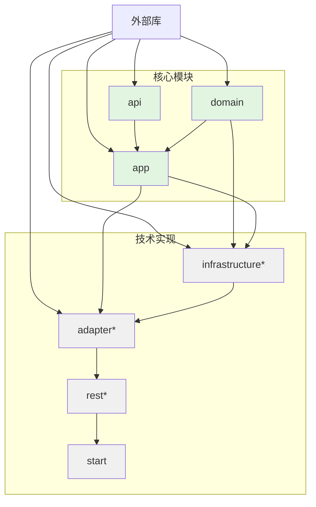

# API 和 APP 模块内容规划

## 项目架构概述

本项目采用六边形架构（Hexagonal Architecture）分层，各模块职责如下：

- **domain**: 领域层，包含核心业务逻辑（实体、值对象、聚合根、领域服务、仓储接口、领域事件）
- **api**: 接口层，定义对外暴露的契约（服务接口、DTO、命令、查询、异常等）
- **app**: 应用层，实现业务流程编排（服务实现、命令处理器、查询处理器、事件处理器等）
- **infrastructure**: 基础设施层，提供技术实现（配置、仓储实现、外部服务、缓存、工具等）
- **adapter**: 适配器层，作为外部接口（Web控制器、RPC提供者、消息队列消费者/生产者等）
- **rest**: REST API 模块（可视为 adapter/web 的一部分）
- **start**: 启动模块，整合所有模块并启动Spring Boot应用

## Domain 模块中的领域服务

### 什么是领域服务？
领域服务（Domain Service）用于封装不属于任何实体或值对象的业务逻辑。例如：
- 跨多个实体的业务规则
- 复杂的计算或转换
- 调用外部依赖但属于核心业务逻辑的操作（通过接口）

### 领域服务 vs 应用服务
- **领域服务**：位于 `domain` 模块，处理纯业务逻辑，不依赖外部技术细节（如数据库、API调用）。
- **应用服务**：位于 `app` 模块，协调领域对象、调用领域服务、管理事务、处理跨领域逻辑。

### 领域服务示例
假设有一个“资金转账”场景：
- `TransferService` 作为领域服务，验证转账规则（如余额不足），但不涉及数据库操作。
- 数据库持久化由仓储接口处理，应用服务调用仓储并管理事务。

### 内容清单
```
domain/src/main/java/com/wsf/domain/service/
├── UserDomainService.java          # 用户领域服务
├── AccountDomainService.java       # 账户领域服务
└── ...
```

### 依赖关系
- 领域服务仅依赖领域模型（实体、值对象）和其他领域服务。
- 不依赖 `api`、`app`、`infrastructure` 模块。

## API 模块职责与内容规范

### 职责
- 定义应用程序对外提供的业务能力（端口）
- 提供跨层数据传输对象（DTO）
- 定义业务异常契约
- 声明命令、查询对象（若采用CQRS）
- 提供枚举、常量等共享类型

### 内容清单
```
api/src/main/java/com/wsf/api/
├── service/                           # 服务接口
│   ├── UserService.java
│   ├── AuthenticationService.java
│   ├── FileService.java              # 已存在
│   └── ...
├── dto/                              # 数据传输对象
│   ├── user/
│   │   ├── UserDto.java
│   │   ├── CreateUserRequest.java
│   │   ├── UpdateUserRequest.java
│   │   └── UserResponse.java
│   ├── auth/
│   │   ├── LoginRequest.java
│   │   ├── LoginResponse.java
│   │   ├── RegisterRequest.java
│   │   └── RegisterResponse.java
│   └── ...
├── command/                          # 命令对象（CQRS）
│   ├── user/
│   │   ├── CreateUserCommand.java
│   │   └── UpdateUserCommand.java
│   └── ...
├── query/                            # 查询对象（CQRS）
│   ├── user/
│   │   ├── GetUserQuery.java
│   │   └── SearchUsersQuery.java
│   └── ...
├── exception/                        # 业务异常
│   ├── UserNotFoundException.java
│   ├── AuthenticationFailedException.java
│   └── ...
├── event/                            # 事件接口（可选）
│   ├── UserCreatedEvent.java
│   └── ...
└── constants/                        # 常量定义
    ├── UserConstants.java
    └── ...
```

### 依赖关系
- 仅依赖外部库（Jakarta Validation、Lombok等）
- **不依赖**任何其他项目模块（保持纯粹契约）

## APP 模块职责与内容规范

### 职责
- 实现 `api` 模块定义的服务接口
- 编排领域对象完成具体用例
- 处理命令、查询、事件
- 管理事务边界
- 进行权限校验（调用基础设施）

### 内容清单
```
app/src/main/java/com/wsf/app/
├── service/                           # 服务实现
│   ├── UserServiceImpl.java
│   ├── AuthenticationServiceImpl.java
│   ├── FileServiceImpl.java
│   └── ...
├── command/                          # 命令处理器（CQRS）
│   ├── handler/
│   │   ├── CreateUserCommandHandler.java
│   │   └── ...
│   └── ...
├── query/                            # 查询处理器（CQRS）
│   ├── handler/
│   │   ├── GetUserQueryHandler.java
│   │   └── ...
│   └── ...
├── event/                            # 事件处理器
│   ├── handler/
│   │   ├── UserCreatedEventHandler.java
│   │   └── ...
│   └── ...
├── executor/                         # 命令执行器（若采用命令模式）
│   └── ...
└── config/                           # 应用层配置（如事务管理）
    └── ...
```

### 依赖关系
- 依赖 `api` 模块（使用接口和DTO）
- 依赖 `domain` 模块（使用领域对象）
- **不直接依赖** `infrastructure` 模块（通过接口访问仓储）
- 可依赖 `infrastructure` 提供的工具类（如 `RedisUtil`、`JwtUtil`）但建议通过接口抽象

## 模块间依赖关系图



> 注：带 * 的依赖为可选或运行时依赖。

## 具体示例：用户管理功能

### 1. API 模块中的接口定义
```java
// UserService.java
package com.wsf.api.service;

import com.wsf.api.dto.user.CreateUserRequest;
import com.wsf.api.dto.user.UpdateUserRequest;
import com.wsf.api.dto.user.UserDto;
import com.wsf.api.exception.UserNotFoundException;

public interface UserService {
    UserDto createUser(CreateUserRequest request);
    UserDto updateUser(Long userId, UpdateUserRequest request);
    UserDto getUser(Long userId) throws UserNotFoundException;
    void deleteUser(Long userId);
}
```

### 2. API 模块中的DTO定义
```java
// CreateUserRequest.java
package com.wsf.api.dto.user;

import jakarta.validation.constraints.Email;
import jakarta.validation.constraints.NotBlank;

public class CreateUserRequest {
    @NotBlank
    private String username;
    @NotBlank
    private String password;
    @Email
    private String email;
    // ... getters/setters
}
```

### 3. APP 模块中的服务实现
```java
// UserServiceImpl.java
package com.wsf.app.service;

import com.wsf.api.service.UserService;
import com.wsf.api.dto.user.*;
import com.wsf.infrastructure.persistence.entity.user.User;
import com.wsf.domain.repository.UserRepository;
import lombok.RequiredArgsConstructor;
import org.springframework.stereotype.Service;
import org.springframework.transaction.annotation.Transactional;

@Service
@RequiredArgsConstructor
public class UserServiceImpl implements UserService {
    private final UserRepository userRepository;
    
    @Override
    @Transactional
    public UserDto createUser(CreateUserRequest request) {
        User user = User.builder()
                .username(request.getUsername())
                .email(request.getEmail())
                .build();
        User saved = userRepository.save(user);
        return convertToDto(saved);
    }
    
    private UserDto convertToDto(User user) {
        // 使用MapStruct或手动转换
        return UserDto.builder()
                .id(user.getId())
                .username(user.getUsername())
                .email(user.getEmail())
                .build();
    }
}
```

## 迁移现有代码的建议

1. **将 `infrastructure/security/service/AuthenticationService` 移动到 `api` 模块**
   - 接口移至 `api/service/AuthenticationService.java`
   - DTO 移至 `api/dto/auth/` 目录

2. **将 `infrastructure/security/service/AuthenticationService` 实现移动到 `app` 模块**
   - 实现类移至 `app/service/AuthenticationServiceImpl.java`
   - 调整依赖注入

3. **将 `infrastructure/security/domain/` 中的请求/响应类移动到 `api/dto/auth/`**

4. **调整 `adapter` 模块的控制器，使其依赖 `api` 接口而非具体实现**

## 案例演示：库存管理系统

以下以库存管理系统为例，展示各模块应包含的具体内容。

### 1. 创建用户

#### Domain 模块
- **实体**：`User`（已存在）、`UserAccount`（已存在）
- **领域服务**：`UserRegistrationService` 处理用户注册逻辑（如用户名唯一性校验）
- **仓储接口**：`UserRepository`、`UserAccountRepository`
- **领域事件**：`UserCreatedEvent`

#### API 模块
- **服务接口**：`UserService` 包含 `createUser` 方法
- **DTO**：`CreateUserRequest`（用户名、密码、邮箱）、`UserResponse`
- **异常**：`UsernameAlreadyExistsException`

#### APP 模块
- **服务实现**：`UserServiceImpl` 实现 `UserService`
- **事件处理器**：`UserCreatedEventHandler` 发送欢迎邮件（模拟）

#### Adapter 模块
- **控制器**：`UserController` 暴露 `POST /api/users`
- **转换器**：`UserConverter` 将 DTO 转换为领域对象

#### Infrastructure 模块
- **仓储实现**：`UserRepositoryImpl`（JPA）
- **事件发布**：集成消息队列或邮件服务

### 2. 创建角色

#### Domain 模块
- **实体**：`Role`（已存在）
- **聚合根**：`Role` 作为聚合根，包含权限集合
- **领域服务**：`RoleAssignmentService` 处理角色分配逻辑

#### API 模块
- **服务接口**：`RoleService` 包含 `createRole`、`assignRole` 方法
- **DTO**：`CreateRoleRequest`（角色名称、权限列表）、`RoleResponse`

#### APP 模块
- **服务实现**：`RoleServiceImpl`
- **命令处理器**：`CreateRoleCommandHandler`（若采用 CQRS）

#### Adapter 模块
- **控制器**：`RoleController` 暴露 `POST /api/roles`

#### Infrastructure 模块
- **仓储实现**：`RoleRepositoryImpl`

### 3. 创建出库单

#### Domain 模块
- **实体**：`OutboundOrder`（聚合根）、`OutboundOrderItem`（值对象）、`Material`、`MaterialStock`
- **领域服务**：`OutboundService` 处理出库单创建、库存扣减、校验
- **仓储接口**：`OutboundOrderRepository`、`MaterialRepository`、`MaterialStockRepository`
- **领域事件**：`OutboundOrderCreatedEvent`、`StockReducedEvent`

#### API 模块
- **服务接口**：`OutboundOrderService` 包含 `createOutboundOrder`、`approveOutboundOrder` 方法
- **DTO**：`CreateOutboundOrderRequest`（包含明细列表）、`OutboundOrderResponse`、`OutboundOrderItemRequest`
- **异常**：`InsufficientStockException`、`MaterialNotFoundException`

#### APP 模块
- **服务实现**：`OutboundOrderServiceImpl` 调用领域服务，管理事务
- **事件处理器**：`OutboundOrderCreatedEventHandler` 通知相关方

#### Adapter 模块
- **控制器**：`OutboundOrderController` 暴露 `POST /api/outbound-orders`
- **转换器**：`OutboundOrderConverter`

#### Infrastructure 模块
- **仓储实现**：`OutboundOrderRepositoryImpl`、`MaterialStockRepositoryImpl`
- **数据库约束**：库存数量检查

### 4. 出库单上的物资来源

#### Domain 模块
- **值对象**：`SourceInfo` 表示来源类型（仓库、批次）和ID
- **出库明细**：`OutboundOrderItem` 包含 `sourceInfo` 字段

#### API 模块
- **DTO**：`SourceInfoDto` 嵌入 `OutboundOrderItemRequest` 中

#### APP 模块
- **业务逻辑**：在创建出库单时验证来源有效性

#### Infrastructure 模块
- **数据查询**：提供根据来源查询库存的接口

### 5. 物资库存表

#### Domain 模块
- **实体**：`MaterialStock` 记录物资当前库存、安全库存、锁定数量
- **领域服务**：`StockService` 提供库存查询、扣减、增加方法

#### API 模块
- **服务接口**：`MaterialStockService` 包含 `getStock`、`updateStock` 方法
- **DTO**：`MaterialStockDto`、`StockUpdateRequest`

#### APP 模块
- **服务实现**：`MaterialStockServiceImpl`
- **事件处理器**：`StockLowEventHandler` 当库存低于安全线时告警

#### Adapter 模块
- **控制器**：`MaterialStockController` 暴露 `GET /api/material-stocks/{materialId}`

#### Infrastructure 模块
- **仓储实现**：`MaterialStockRepositoryImpl`
- **缓存**：使用 Redis 缓存热点物资库存

### 总结文件结构

```
domain/src/main/java/com/wsf/domain/
├── model/
│   ├── entity/
│   │   ├── User.java
│   │   ├── Role.java
│   │   ├── Material.java
│   │   ├── MaterialStock.java
│   │   ├── OutboundOrder.java
│   │   └── OutboundOrderItem.java
│   ├── valueobject/
│   │   └── SourceInfo.java
│   └── aggregate/
├── service/
│   ├── UserRegistrationService.java
│   ├── RoleAssignmentService.java
│   ├── OutboundService.java
│   └── StockService.java
├── repository/
│   ├── UserRepository.java
│   ├── RoleRepository.java
│   ├── MaterialRepository.java
│   ├── MaterialStockRepository.java
│   └── OutboundOrderRepository.java
└── event/
    ├── UserCreatedEvent.java
    ├── OutboundOrderCreatedEvent.java
    └── StockReducedEvent.java

api/src/main/java/com/wsf/api/
├── service/
│   ├── UserService.java
│   ├── RoleService.java
│   ├── OutboundOrderService.java
│   └── MaterialStockService.java
├── dto/
│   ├── user/
│   ├── role/
│   ├── outbound/
│   └── stock/
└── exception/

app/src/main/java/com/wsf/app/
├── service/
│   ├── UserServiceImpl.java
│   ├── RoleServiceImpl.java
│   ├── OutboundOrderServiceImpl.java
│   └── MaterialStockServiceImpl.java
├── command/
├── query/
└── event/

adapter/src/main/java/com/wsf/adapter/web/
├── controller/
│   ├── UserController.java
│   ├── RoleController.java
│   ├── OutboundOrderController.java
│   └── MaterialStockController.java
└── converter/

infrastructure/src/main/java/com/wsf/infrastructure/
├── repository/
│   └── impl/
│       ├── UserRepositoryImpl.java
│       ├── RoleRepositoryImpl.java
│       ├── MaterialRepositoryImpl.java
│       ├── MaterialStockRepositoryImpl.java
│       └── OutboundOrderRepositoryImpl.java
└── external/
```

## 下一步行动

1. 确认本规划是否符合项目预期
2. 如需调整，请提供具体修改意见
3. 确认后，可切换到 Code 模式开始实施