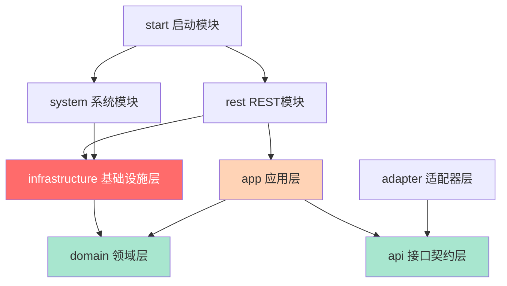
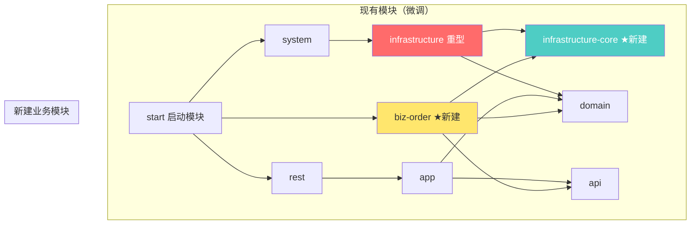
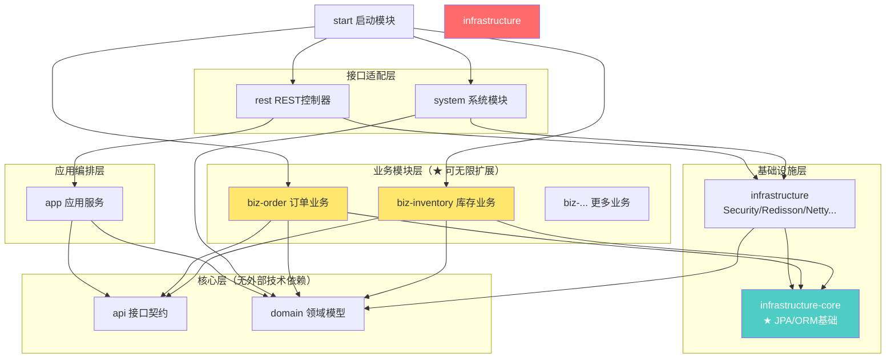

# 业务模块独立化方案：不依赖 `infrastructure` 即可使用 JPA + 项目 API

## 一、问题分析

### 1.1 当前架构痛点

当前项目 DDD 分层结构如下：



**核心问题**：新建一个业务模块（如 `biz-order`），若要使用项目的 JPA/ORM 能力，必须依赖 [`infrastructure`](infrastructure/pom.xml:1) 模块。但 [`infrastructure`](infrastructure/pom.xml:1) 是一个"重型"模块，捆绑引入了：

| 依赖项                                                | 类型                 | 业务模块是否需要 |
| ----------------------------------------------------- | -------------------- | :--------------: |
| `spring-boot-starter-security`                        | Spring Security      |        ❌        |
| `redisson-spring-boot-starter`                        | 分布式锁/缓存        |        ❌        |
| `netty-all`                                           | TCP/WebSocket 通信   |        ❌        |
| `spring-boot-starter-quartz`                          | 定时任务             |        ❌        |
| `spring-boot-starter-integration` + MQTT              | 消息集成             |        ❌        |
| `knife4j-openapi3-jakarta-spring-boot-starter`        | API 文档             |        ❌        |
| `resilience4j-*`                                      | 限流/熔断            |        ❌        |
| `hutool-all`                                          | 工具库               |        ❌        |
| `bouncycastle`                                        | 加密（已移至system） |        ❌        |
| `spring-boot-starter-data-jpa` + QueryDSL             | JPA/ORM              |        ✅        |
| `BaseEntity` + `OpenRepository` + `CustomIdGenerator` | JPA 基础类           |        ✅        |
| `OpenPrimaryDataSource` + `OpenPrimaryJpaConfig`      | 数据源/JPA配置       |        ✅        |

### 1.2 当前 JPA 扫描的硬编码限制

[`OpenPrimaryJpaConfig`](infrastructure/src/main/java/com/wsf/infrastructure/jpa/config/OpenPrimaryJpaConfig.java:48) 中硬编码了包扫描路径：

```java
public static final String REPOSITORY_PACKAGE = "com.wsf.infrastructure.**";
public static final String DOMAIN_PACKAGE = "com.wsf.domain.**";
```

这导致即使业务模块打包进 classpath，其 Entity 和 Repository 也不会被 JPA 扫描到。

---

## 二、解决方案：提取 `infrastructure-core` 轻量模块

### 2.1 核心思路

将 `infrastructure` 模块中与 JPA/ORM 相关且轻量的基础类提取到一个新的 `infrastructure-core` 模块中。业务模块只需依赖 `infrastructure-core` + `api` + `domain`，无需引入整个 `infrastructure`。



### 2.2 `infrastructure-core` 模块内容清单

| 类/文件                                                                                                                           | 原路径                              | 用途                                       | 优先级 |
| --------------------------------------------------------------------------------------------------------------------------------- | ----------------------------------- | ------------------------------------------ | :----: |
| [`BaseEntity`](infrastructure/src/main/java/com/wsf/infrastructure/persistence/entity/BaseEntity.java:22)                         | `infrastructure.persistence.entity` | JPA `@MappedSuperclass`，含ID生成+审计字段 |   P0   |
| [`EnhanceJpaRepository`](infrastructure/src/main/java/com/wsf/infrastructure/jpa/repository/EnhanceJpaRepository.java:10)         | `infrastructure.jpa.repository`     | 增强 JPA Repository 接口                   |   P0   |
| [`EnhanceJpaRepositoryImpl`](infrastructure/src/main/java/com/wsf/infrastructure/jpa/repository/EnhanceJpaRepositoryImpl.java:14) | `infrastructure.jpa.repository`     | 增强实现类（`getReference` 方法）          |   P0   |
| [`OpenRepository`](infrastructure/src/main/java/com/wsf/infrastructure/jpa/repository/OpenRepository.java:7)                      | `infrastructure.jpa.repository`     | 组合 `EnhanceJpaRepository` + QueryDSL     |   P0   |
| [`CustomIdGenerator`](infrastructure/src/main/java/com/wsf/infrastructure/jpa/id/CustomIdGenerator.java:14)                       | `infrastructure.jpa.id`             | UUID v7 主键生成策略                       |   P0   |
| [`BaseId`](infrastructure/src/main/java/com/wsf/infrastructure/jpa/id/annotation/BaseId.java)                                     | `infrastructure.jpa.id.annotation`  | 标记注解                                   |   P1   |
| [`CurrentUserAuditorAware`](infrastructure/src/main/java/com/wsf/infrastructure/jpa/audit/CurrentUserAuditorAware.java)           | `infrastructure.jpa.audit`          | JPA 审计用户自动填充                       |   P1   |
| [`OpenPrimaryDataSource`](infrastructure/src/main/java/com/wsf/infrastructure/datasource/OpenPrimaryDataSource.java:17)           | `infrastructure.datasource`         | 主数据源配置                               |   P0   |
| [`OpenPrimaryJpaConfig`](infrastructure/src/main/java/com/wsf/infrastructure/jpa/config/OpenPrimaryJpaConfig.java:45)             | `infrastructure.jpa.config`         | JPA 核心配置（**需改造**）                 |   P0   |

> **注**：移动后原 `infrastructure` 模块中的类保留为 `@Deprecated` 空壳子类，继承自 `infrastructure-core`，保证向后兼容。

### 2.3 `infrastructure-core` 的 Maven 依赖

```xml
<dependencies>
    <!-- 仅 JPA 相关，无 Security/Redisson/Netty/MQTT -->
    <dependency>
        <groupId>org.springframework.boot</groupId>
        <artifactId>spring-boot-starter-data-jpa</artifactId>
    </dependency>
    <dependency>
        <groupId>com.querydsl</groupId>
        <artifactId>querydsl-jpa</artifactId>
        <classifier>jakarta</classifier>
    </dependency>
    <dependency>
        <groupId>com.github.f4b6a3</groupId>
        <artifactId>uuid-creator</artifactId>  <!-- CustomIdGenerator 需要 -->
    </dependency>
    <dependency>
        <groupId>org.projectlombok</groupId>
        <artifactId>lombok</artifactId>
        <optional>true</optional>
    </dependency>
</dependencies>
```

**依赖体积对比**：

| 模块                  | 传递依赖数量（估算） | JAR 体积（估算） |
| --------------------- | :------------------: | :--------------: |
| `infrastructure`      |         ~40+         |      ~50MB+      |
| `infrastructure-core` |          ~8          |       ~5MB       |

---

## 三、JPA 配置改造：支持扩展扫描

### 3.1 改造 `OpenPrimaryJpaConfig`

当前硬编码的包扫描需要改为支持业务模块扩展：

```java
// 改造前（硬编码）
public static final String REPOSITORY_PACKAGE = "com.wsf.infrastructure.**";
public static final String DOMAIN_PACKAGE = "com.wsf.domain.**";

// 改造后（通配扫描 + 可配置扩展）
public static final String REPOSITORY_PACKAGE = "com.wsf.**.persistence.repository";
public static final String DOMAIN_PACKAGE = "com.wsf.**.persistence.entity";
```

或将 `@EntityScan` 和 `@EnableJpaRepositories` 的 `basePackages` 扩展为：

```java
@EntityScan(basePackages = {
    "com.wsf.infrastructure.persistence.entity",
    "com.wsf.**.entity",          // 扫描所有模块的 entity 包
    "com.wsf.**.persistence.entity"
})
@EnableJpaRepositories(basePackages = {
    "com.wsf.infrastructure.persistence.repository",
    "com.wsf.**.repository",       // 扫描所有模块的 repository 包
    "com.wsf.**.persistence.repository"
})
```

### 3.2 业务模块约定目录结构

业务模块的 Entity 和 Repository 按以下包路径组织即可被自动扫描：

```
biz-order/src/main/java/com/wsf/biz/order/
├── entity/                          # JPA Entity（被 @EntityScan 扫描）
│   ├── Order.java
│   └── OrderItem.java
├── repository/                      # Spring Data Repository（被 @EnableJpaRepositories 扫描）
│   ├── OrderRepository.java
│   └── OrderItemRepository.java
├── service/                         # 业务服务实现
│   └── OrderServiceImpl.java
└── dto/                             # 模块私有 DTO
    ├── CreateOrderRequest.java
    └── OrderDto.java
```

---

## 四、新建业务模块的标准模板

### 4.1 `pom.xml` 模板

```xml
<?xml version="1.0" encoding="UTF-8"?>
<project xmlns="http://maven.apache.org/POM/4.0.0"
         xmlns:xsi="http://www.w3.org/2001/XMLSchema-instance"
         xsi:schemaLocation="http://maven.apache.org/POM/4.0.0 http://maven.apache.org/xsd/maven-4.0.0.xsd">
    <parent>
        <groupId>com.wsf</groupId>
        <artifactId>study_spring</artifactId>
        <version>1.0-SNAPSHOT</version>
    </parent>
    <modelVersion>4.0.0</modelVersion>

    <artifactId>biz-order</artifactId>

    <dependencies>
        <!-- ★ 轻量JPA基础（替代 infrastructure） -->
        <dependency>
            <groupId>com.wsf</groupId>
            <artifactId>infrastructure-core</artifactId>
            <version>${project.version}</version>
        </dependency>

        <!-- ★ 项目公开API（服务接口 + DTO） -->
        <dependency>
            <groupId>com.wsf</groupId>
            <artifactId>api</artifactId>
            <version>${project.version}</version>
        </dependency>

        <!-- ★ 领域模型 -->
        <dependency>
            <groupId>com.wsf</groupId>
            <artifactId>domain</artifactId>
            <version>${project.version}</version>
        </dependency>

        <!-- Spring 依赖 -->
        <dependency>
            <groupId>org.springframework</groupId>
            <artifactId>spring-tx</artifactId>
        </dependency>

        <!-- 工具库 -->
        <dependency>
            <groupId>org.projectlombok</groupId>
            <artifactId>lombok</artifactId>
            <optional>true</optional>
        </dependency>
        <dependency>
            <groupId>org.apache.commons</groupId>
            <artifactId>commons-lang3</artifactId>
        </dependency>
        <dependency>
            <groupId>com.google.guava</groupId>
            <artifactId>guava</artifactId>
        </dependency>

        <!-- Object Mapping -->
        <dependency>
            <groupId>org.mapstruct</groupId>
            <artifactId>mapstruct</artifactId>
        </dependency>
        <dependency>
            <groupId>org.mapstruct</groupId>
            <artifactId>mapstruct-processor</artifactId>
            <scope>provided</scope>
        </dependency>

        <!-- Test -->
        <dependency>
            <groupId>org.springframework.boot</groupId>
            <artifactId>spring-boot-starter-test</artifactId>
            <scope>test</scope>
        </dependency>
    </dependencies>
</project>
```

### 4.2 Entity 示例

```java
package com.wsf.biz.order.entity;

import com.wsf.infrastructurecore.persistence.entity.BaseEntity;  // ★ 使用 core 中的 BaseEntity
import jakarta.persistence.*;
import lombok.*;
import org.hibernate.annotations.Comment;
import org.springframework.data.jpa.domain.support.AuditingEntityListener;

@Entity
@Table(name = "T_BIZ_ORDER_")
@Comment("订单表")
@EntityListeners(AuditingEntityListener.class)
@Getter @Setter
@NoArgsConstructor @AllArgsConstructor
@Builder
public class Order extends BaseEntity {

    @Column(name = "order_no_", length = 64, nullable = false, unique = true)
    private String orderNo;

    @Column(name = "customer_name_", length = 128)
    private String customerName;

    @Column(name = "total_amount_")
    private BigDecimal totalAmount;

    @Enumerated(EnumType.STRING)
    @Column(name = "status_", length = 32)
    private OrderStatus status;
}
```

### 4.3 Repository 示例

```java
package com.wsf.biz.order.repository;

import com.wsf.biz.order.entity.Order;
import com.wsf.infrastructurecore.jpa.repository.OpenRepository;  // ★ 使用 core 中的 OpenRepository
import org.springframework.stereotype.Repository;

@Repository
public interface OrderRepository extends OpenRepository<Order> {
    // OpenRepository 已包含 JpaRepository + JpaSpecificationExecutor + QuerydslPredicateExecutor
    // 可直接在此添加自定义查询方法
    Optional<Order> findByOrderNo(String orderNo);
}
```

### 4.4 Service 示例（使用项目公开 API）

```java
package com.wsf.biz.order.service;

import com.wsf.api.service.DataPermissionService;     // ★ 注入项目公开的 API 服务
import com.wsf.biz.order.entity.Order;
import com.wsf.biz.order.repository.OrderRepository;
import lombok.RequiredArgsConstructor;
import org.springframework.stereotype.Service;
import org.springframework.transaction.annotation.Transactional;

@Service
@RequiredArgsConstructor
public class OrderService {

    private final OrderRepository orderRepository;

    // ★ 直接注入 api 模块中定义的公共服务接口，
    // Spring 会自动找到 app 模块中的实现类
    private final DataPermissionService dataPermissionService;

    @Transactional
    public Order createOrder(CreateOrderRequest request) {
        Order order = Order.builder()
                .orderNo(generateOrderNo())
                .customerName(request.getCustomerName())
                .totalAmount(request.getTotalAmount())
                .status(OrderStatus.PENDING)
                .build();
        return orderRepository.save(order);
    }
}
```

### 4.5 启动集成

在父 `pom.xml` 的 `<modules>` 中添加：

```xml
<module>biz-order</module>
```

在 [`start/pom.xml`](start/pom.xml:20) 中添加运行时依赖：

```xml
<dependency>
    <groupId>com.wsf</groupId>
    <artifactId>biz-order</artifactId>
    <version>${project.version}</version>
</dependency>
```

由于 [`StartApplication`](start/src/main/java/com/wsf/StartApplication.java:18) 使用 `scanBasePackages = "com.wsf"`，业务模块中所有 `com.wsf.biz.order` 包下的 Spring 组件会被**自动发现和装配**，无需额外配置。

---

## 五、模块依赖关系总览



---

## 六、实施步骤

### 阶段一：提取 `infrastructure-core` 模块（P0）

| 步骤 | 内容                                                                                                                                                                         |              风险              |
| :--: | ---------------------------------------------------------------------------------------------------------------------------------------------------------------------------- | :----------------------------: |
|  1   | 创建 `infrastructure-core` 子模块，配置 `pom.xml`                                                                                                                            |               低               |
|  2   | 将 `BaseEntity`、`EnhanceJpaRepository`、`EnhanceJpaRepositoryImpl`、`OpenRepository`、`CustomIdGenerator`、`BaseId`、`CurrentUserAuditorAware` 移动到 `infrastructure-core` | 中 - 影响全部现有模块的 import |
|  3   | 将 `OpenPrimaryDataSource`、`OpenPrimaryJpaConfig` 移动到 `infrastructure-core`                                                                                              |        中 - JPA配置迁移        |
|  4   | 在 `infrastructure` 中保留兼容性的空壳子类（`@Deprecated`），继承自 `infrastructure-core`                                                                                    |               低               |
|  5   | 更新 `infrastructure` 的 `pom.xml`，添加对 `infrastructure-core` 的依赖                                                                                                      |               低               |
|  6   | 更新所有现有模块的 import 路径（或通过空壳子类兼容过渡）                                                                                                                     |      高 - 需全量回归测试       |

### 阶段二：改造 JPA 扫描配置（P0）

| 步骤 | 内容                                                                                    |       风险        |
| :--: | --------------------------------------------------------------------------------------- | :---------------: |
|  1   | 修改 `OpenPrimaryJpaConfig` 的 `@EntityScan` 和 `@EnableJpaRepositories` 为通配扫描模式 | 中 - 需验证不误扫 |
|  2   | 扩展 `EntityManagerFactoryBuilder.packages()` 参数覆盖业务模块                          |        低         |
|  3   | 验证现有 Entity 和 Repository 仍能正常加载                                              |        低         |

### 阶段三：创建示例业务模块（P1）

| 步骤 | 内容                                           | 风险 |
| :--: | ---------------------------------------------- | :--: |
|  1   | 创建 `biz-order` 示例业务模块                  |  低  |
|  2   | 编写示例 Entity、Repository、Service           |  低  |
|  3   | 在 `start` 模块中注册依赖，验证启动 + ORM 功能 |  低  |

### 阶段四：更新父 POM 和文档（P1）

| 步骤 | 内容                                             | 风险 |
| :--: | ------------------------------------------------ | :--: |
|  1   | 父 `pom.xml` 添加 `infrastructure-core` 模块声明 |  低  |
|  2   | 更新 `dependencyManagement`（如需要）            |  低  |
|  3   | 编写业务模块开发指南文档                         |  低  |

---

## 七、风险与缓解措施

| 风险项                          | 影响等级 | 缓解措施                                                                                         |
| ------------------------------- | :------: | ------------------------------------------------------------------------------------------------ |
| **大规模 import 变更**          |  🔴 高   | 分两阶段：先保留空壳子类兼容，标记 `@Deprecated`；后续版本统一迁移 import                        |
| **JPA 通配扫描误扫**            |  🟡 中   | 使用精确的包名约定（如 `**.persistence.entity` 而非 `**`），配置 `@ComponentScan.excludeFilters` |
| **EntityManagerFactory 包冲突** |  🟡 中   | 确保 `packages()` 参数不重复扫描相同实体类                                                       |
| **循环依赖**                    |  🟢 低   | `infrastructure-core` 不依赖任何项目内部模块（仅依赖 Spring Boot Starter + QueryDSL）            |
| **现有测试失败**                |  🟡 中   | 迁移后全量运行测试套件，逐模块修复                                                               |

---

## 八、替代方案对比

| 方案                                      | 优点                                      | 缺点                                                           |   推荐度   |
| ----------------------------------------- | ----------------------------------------- | -------------------------------------------------------------- | :--------: |
| **A. 提取 `infrastructure-core`**（推荐） | 复用现有 JPA 基础设施，依赖轻量，架构清晰 | 需要一次性重构，import 变更量大                                | ⭐⭐⭐⭐⭐ |
| B. 业务模块完全独立配置 JPA               | 零改动现有代码                            | 需复制 `BaseEntity`/配置，无法复用 `OpenRepository` 等增强功能 |    ⭐⭐    |
| C. 业务模块直接依赖 `infrastructure`      | 零架构改动                                | 引入全部重型依赖，编译慢、体积大、耦合重                       |     ⭐     |
| D. 将 JPA 基础类下沉到 `domain` 模块      | 减少一个模块                              | 违反 DDD 分层原则（domain 不应含 JPA 注解/基础设施）           |    ⭐⭐    |

---

## 九、下一步行动

1. **请审查以上方案**，确认是否满足你的预期
2. 如需调整（如命名、目录结构、提取粒度），请提出修改意见
3. 确认后，切换到 **💻 Code 模式** 开始实施
