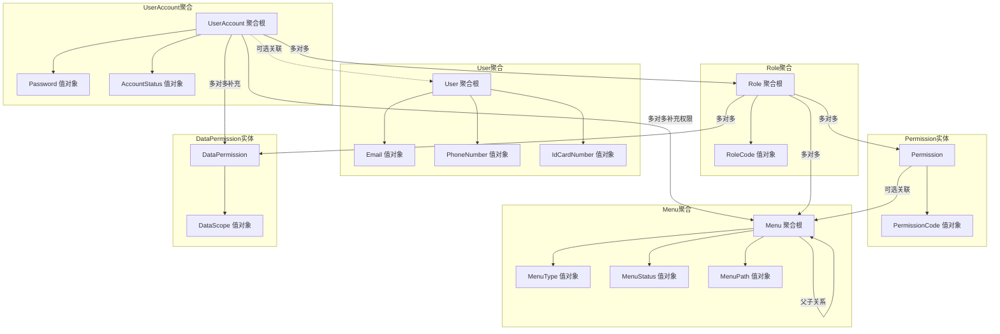
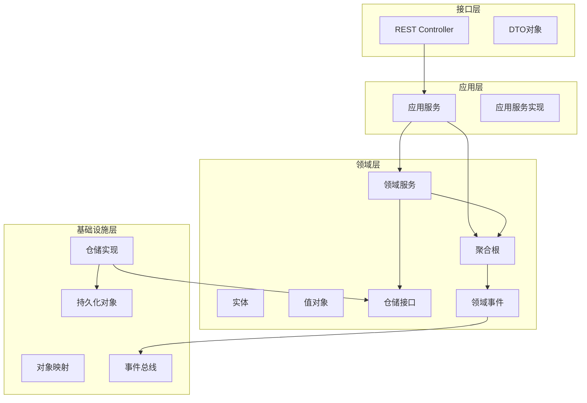
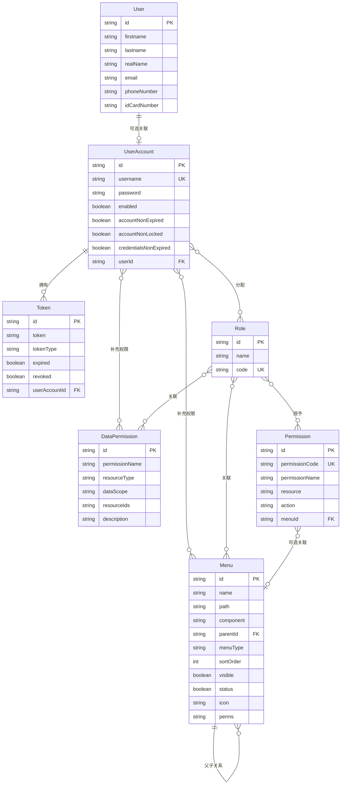
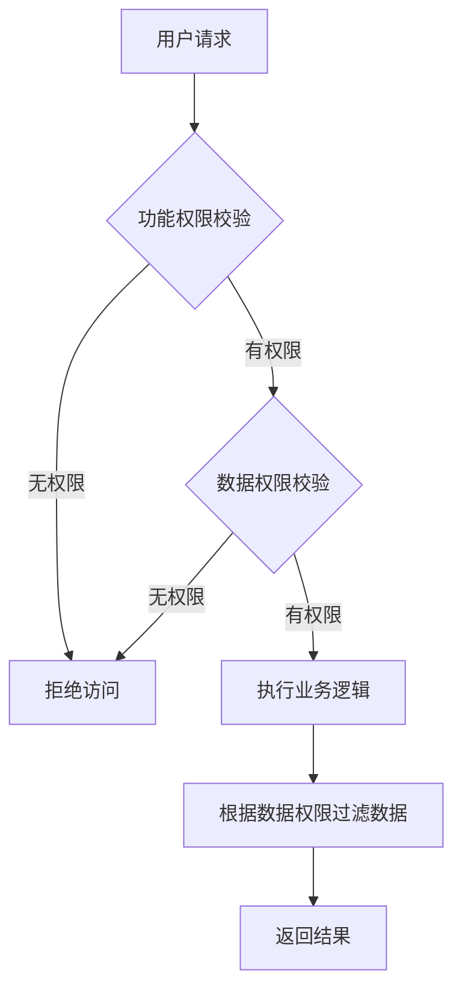

# DDD用户模块与角色模块完善计划

## 一、需求分析

### 1.1 业务需求
- **User（用户）**：表示人员信息，可以独立存在，不一定需要账户
- **UserAccount（账户）**：用于登录系统的账户，可选关联User
- **完整RBAC模型**：用户-角色-权限-菜单的完整实现
- **Menu（菜单）**：系统菜单，支持树形结构，关联角色

### 1.2 现有问题
1. 领域层（domain）几乎为空，缺乏领域模型设计
2. 实体类放在infrastructure层，不符合DDD规范
3. 缺少值对象（Value Object）设计
4. 缺少聚合根（Aggregate Root）概念
5. 缺少权限（Permission）实体
6. 菜单（Menu）实体在system模块，未按DDD规范设计
7. 服务接口和实现不完整

---

## 二、领域模型设计

### 2.1 聚合设计



### 2.2 领域模型详细设计

#### 2.2.1 User聚合

| 类型 | 名称 | 说明 |
|------|------|------|
| 聚合根 | User | 用户基本信息 |
| 值对象 | Email | 邮箱，包含格式验证 |
| 值对象 | PhoneNumber | 手机号，包含格式验证 |
| 值对象 | IdCardNumber | 身份证号，包含格式验证 |
| 值对象 | UserName | 用户姓名（姓+名） |

#### 2.2.2 UserAccount聚合

| 类型 | 名称 | 说明 |
|------|------|------|
| 聚合根 | UserAccount | 账户信息 |
| 值对象 | Password | 密码，包含加密逻辑 |
| 值对象 | AccountStatus | 账户状态（启用/禁用/锁定/过期） |
| 实体 | Token | 登录令牌 |
| 关联 | menus | 用户补充菜单权限（多对多） |
| 关联 | dataPermissions | 用户数据权限（多对多） |

#### 2.2.3 Role聚合

| 类型 | 名称 | 说明 |
|------|------|------|
| 聚合根 | Role | 角色信息 |
| 值对象 | RoleCode | 角色编码 |
| 值对象 | RoleName | 角色名称 |
| 关联 | dataPermissions | 角色数据权限（多对多） |

#### 2.2.4 Permission实体

| 类型 | 名称 | 说明 |
|------|------|------|
| 实体 | Permission | 权限信息 |
| 值对象 | PermissionCode | 权限编码 |
| 值对象 | Resource | 资源标识 |

#### 2.2.5 Menu聚合

| 类型 | 名称 | 说明 |
|------|------|------|
| 聚合根 | Menu | 菜单信息，支持树形结构 |
| 值对象 | MenuType | 菜单类型（目录/菜单/按钮） |
| 值对象 | MenuStatus | 菜单状态（显示/隐藏） |
| 值对象 | MenuPath | 菜单路径 |
| 值对象 | MenuIcon | 菜单图标 |

#### 2.2.6 DataPermission实体

| 类型 | 名称 | 说明 |
|------|------|------|
| 实体 | DataPermission | 数据权限信息 |
| 值对象 | DataScope | 数据范围（全部/本部门/本部门及以下/仅本人/自定义） |
| 值对象 | ResourceType | 资源类型（部门/组织等） |
| 属性 | resourceIds | 自定义资源ID列表 |
| 值对象 | MenuPath | 菜单路径 |
| 值对象 | MenuIcon | 菜单图标 |

---

## 三、模块分层架构



---

## 四、详细实现计划

### 4.1 领域层（domain模块）

#### 4.1.1 值对象创建

```
domain/src/main/java/com/wsf/domain/
├── model/
│   ├── user/
│   │   ├── aggregate/
│   │   │   └── User.java                    # User聚合根
│   │   ├── entity/
│   │   │   └── UserProfile.java             # 用户档案实体
│   │   └── valueobject/
│   │       ├── Email.java                   # 邮箱值对象
│   │       ├── PhoneNumber.java             # 手机号值对象
│   │       ├── IdCardNumber.java            # 身份证号值对象
│   │       └── UserName.java                # 用户姓名值对象
│   ├── account/
│   │   ├── aggregate/
│   │   │   └── UserAccount.java             # UserAccount聚合根
│   │   ├── entity/
│   │   │   └── Token.java                   # 令牌实体
│   │   └── valueobject/
│   │       ├── Password.java                # 密码值对象
│   │       └── AccountStatus.java           # 账户状态值对象
│   ├── role/
│   │   ├── aggregate/
│   │   │   └── Role.java                    # Role聚合根
│   │   └── valueobject/
│   │       ├── RoleCode.java                # 角色编码值对象
│   │       └── RoleName.java                # 角色名称值对象
│   ├── permission/
│   │   ├── entity/
│   │   │   └── Permission.java              # 权限实体
│   │   └── valueobject/
│   │       ├── PermissionCode.java          # 权限编码值对象
│   │       └── Resource.java                # 资源值对象
│   └── menu/
│       ├── aggregate/
│       │   └── Menu.java                    # Menu聚合根
│       ├── entity/
│       │   └── MenuItem.java                # 菜单项实体
│       └── valueobject/
│           ├── MenuType.java                # 菜单类型值对象
│           ├── MenuStatus.java              # 菜单状态值对象
│           ├── MenuPath.java                # 菜单路径值对象
│           └── MenuIcon.java                # 菜单图标值对象
│   └── datapermission/
│       ├── entity/
│       │   └── DataPermission.java          # 数据权限实体
│       └── valueobject/
│           ├── DataScope.java               # 数据范围值对象
│           └── ResourceType.java            # 资源类型值对象
```

#### 4.1.2 仓储接口定义

```
domain/src/main/java/com/wsf/domain/
├── repository/
│   ├── UserRepository.java                  # 用户仓储接口
│   ├── UserAccountRepository.java           # 账户仓储接口
│   ├── RoleRepository.java                  # 角色仓储接口
│   ├── PermissionRepository.java            # 权限仓储接口
│   ├── MenuRepository.java                  # 菜单仓储接口
│   └── DataPermissionRepository.java        # 数据权限仓储接口
```

#### 4.1.3 领域服务定义

```
domain/src/main/java/com/wsf/domain/
├── service/
│   ├── UserDomainService.java               # 用户领域服务
│   ├── UserAccountDomainService.java        # 账户领域服务
│   ├── RoleDomainService.java               # 角色领域服务
│   ├── PermissionDomainService.java         # 权限领域服务
│   ├── MenuDomainService.java               # 菜单领域服务
│   └── DataPermissionDomainService.java     # 数据权限领域服务
```

#### 4.1.4 领域事件定义

```
domain/src/main/java/com/wsf/domain/
├── event/
│   ├── UserCreatedEvent.java                # 用户创建事件
│   ├── UserUpdatedEvent.java                # 用户更新事件
│   ├── AccountCreatedEvent.java             # 账户创建事件
│   ├── AccountLockedEvent.java              # 账户锁定事件
│   ├── RoleAssignedEvent.java               # 角色分配事件
│   ├── PermissionGrantedEvent.java          # 权限授予事件
│   ├── MenuCreatedEvent.java                # 菜单创建事件
│   └── DataPermissionAssignedEvent.java     # 数据权限分配事件
```

### 4.2 API层（api模块）

#### 4.2.1 DTO定义

```
api/src/main/java/com/wsf/api/
├── dto/
│   ├── user/
│   │   ├── UserDto.java                     # 用户响应DTO
│   │   ├── CreateUserRequest.java           # 创建用户请求
│   │   ├── UpdateUserRequest.java           # 更新用户请求
│   │   └── UserQueryRequest.java            # 用户查询请求
│   ├── account/
│   │   ├── AccountDto.java                  # 账户响应DTO
│   │   ├── CreateAccountRequest.java        # 创建账户请求
│   │   ├── UpdateAccountRequest.java        # 更新账户请求
│   │   └── LoginRequest.java                # 登录请求
│   ├── role/
│   │   ├── RoleDto.java                     # 角色响应DTO
│   │   ├── CreateRoleRequest.java           # 创建角色请求
│   │   └── UpdateRoleRequest.java           # 更新角色请求
│   ├── permission/
│   │   ├── PermissionDto.java               # 权限响应DTO
│   │   ├── CreatePermissionRequest.java     # 创建权限请求
│   │   └── UpdatePermissionRequest.java     # 更新权限请求
│   └── menu/
│       ├── MenuDto.java                     # 菜单响应DTO
│       ├── MenuTreeDto.java                 # 菜单树响应DTO
│       ├── CreateMenuRequest.java           # 创建菜单请求
│       └── UpdateMenuRequest.java           # 更新菜单请求
│   └── datapermission/
│       ├── DataPermissionDto.java           # 数据权限响应DTO
│       ├── CreateDataPermissionRequest.java # 创建数据权限请求
│       └── UpdateDataPermissionRequest.java # 更新数据权限请求
```

#### 4.2.2 服务接口定义

```
api/src/main/java/com/wsf/api/
├── service/
│   ├── UserService.java                     # 用户服务接口
│   ├── UserAccountService.java              # 账户服务接口
│   ├── RoleService.java                     # 角色服务接口
│   ├── PermissionService.java               # 权限服务接口
│   ├── MenuService.java                     # 菜单服务接口
│   └── DataPermissionService.java           # 数据权限服务接口
```

### 4.3 应用层（app模块）

```
app/src/main/java/com/wsf/app/
├── service/
│   ├── UserServiceImpl.java                 # 用户服务实现
│   ├── UserAccountServiceImpl.java          # 账户服务实现
│   ├── RoleServiceImpl.java                 # 角色服务实现
│   ├── PermissionServiceImpl.java           # 权限服务实现
│   ├── MenuServiceImpl.java                 # 菜单服务实现
│   └── DataPermissionServiceImpl.java       # 数据权限服务实现
├── assembler/
│   ├── UserAssembler.java                   # 用户DTO转换器
│   ├── AccountAssembler.java                # 账户DTO转换器
│   ├── RoleAssembler.java                   # 角色DTO转换器
│   ├── PermissionAssembler.java             # 权限DTO转换器
│   ├── MenuAssembler.java                   # 菜单DTO转换器
│   └── DataPermissionAssembler.java         # 数据权限DTO转换器
```

### 4.4 基础设施层（infrastructure模块）

#### 4.4.1 持久化对象（保持现有结构）

```
infrastructure/src/main/java/com/wsf/infrastructure/persistence/
├── entity/
│   ├── user/
│   │   ├── UserPO.java                      # 用户持久化对象（重命名）
│   │   └── UserAccountPO.java               # 账户持久化对象（重命名）
│   ├── role/
│   │   └── RolePO.java                      # 角色持久化对象（重命名）
│   ├── permission/
│   │   └── PermissionPO.java                # 权限持久化对象（新增）
│   ├── menu/
│   │   └── MenuPO.java                      # 菜单持久化对象（从system迁移）
│   └── datapermission/
│       └── DataPermissionPO.java            # 数据权限持久化对象（新增）
```

#### 4.4.2 仓储实现

```
infrastructure/src/main/java/com/wsf/infrastructure/persistence/
├── repository/
│   ├── UserRepositoryImpl.java              # 用户仓储实现
│   ├── UserAccountRepositoryImpl.java       # 账户仓储实现
│   ├── RoleRepositoryImpl.java              # 角色仓储实现
│   ├── PermissionRepositoryImpl.java        # 权限仓储实现
│   ├── MenuRepositoryImpl.java              # 菜单仓储实现
│   └── DataPermissionRepositoryImpl.java    # 数据权限仓储实现
├── converter/
│   ├── UserConverter.java                   # 用户领域-持久化转换
│   ├── AccountConverter.java                # 账户领域-持久化转换
│   ├── RoleConverter.java                   # 角色领域-持久化转换
│   ├── PermissionConverter.java             # 权限领域-持久化转换
│   ├── MenuConverter.java                   # 菜单领域-持久化转换
│   └── DataPermissionConverter.java         # 数据权限领域-持久化转换
```

---

## 五、核心代码示例

### 5.1 值对象示例 - Email

```java
package com.wsf.domain.model.user.valueobject;

import java.util.regex.Pattern;

public record Email(String value) {
    
    private static final Pattern EMAIL_PATTERN = 
        Pattern.compile("^[A-Za-z0-9+_.-]+@(.+)$");
    
    public Email {
        if (value != null && !EMAIL_PATTERN.matcher(value).matches()) {
            throw new IllegalArgumentException("Invalid email format: " + value);
        }
    }
    
    public static Email of(String value) {
        return new Email(value);
    }
}
```

### 5.2 聚合根示例 - User

```java
package com.wsf.domain.model.user.aggregate;

import com.wsf.domain.model.user.valueobject.*;
import com.wsf.domain.event.UserCreatedEvent;
import lombok.Getter;

@Getter
public class User {
    private final String id;
    private UserName name;
    private Email email;
    private PhoneNumber phoneNumber;
    private IdCardNumber idCardNumber;
    
    public User(String id, UserName name, Email email, 
                PhoneNumber phoneNumber, IdCardNumber idCardNumber) {
        this.id = id;
        this.name = name;
        this.email = email;
        this.phoneNumber = phoneNumber;
        this.idCardNumber = idCardNumber;
        // 发布领域事件
        registerEvent(new UserCreatedEvent(this, id, name, email));
    }
    
    public void updateProfile(UserName name, Email email, PhoneNumber phoneNumber) {
        this.name = name;
        this.email = email;
        this.phoneNumber = phoneNumber;
    }
}
```

### 5.3 仓储接口示例

```java
package com.wsf.domain.repository;

import com.wsf.domain.model.user.aggregate.User;
import com.wsf.domain.model.user.valueobject.Email;
import java.util.Optional;

public interface UserRepository {
    User save(User user);
    Optional<User> findById(String id);
    Optional<User> findByEmail(Email email);
    void deleteById(String id);
}
```

### 5.4 领域服务示例

```java
package com.wsf.domain.service;

import com.wsf.domain.model.user.aggregate.User;
import com.wsf.domain.model.user.valueobject.*;
import com.wsf.domain.repository.UserRepository;

public class UserDomainService {
    
    private final UserRepository userRepository;
    
    public User createUser(UserName name, Email email, 
                          PhoneNumber phoneNumber, IdCardNumber idCardNumber) {
        // 检查邮箱是否已存在
        if (userRepository.findByEmail(email).isPresent()) {
            throw new IllegalStateException("Email already exists: " + email.value());
        }
        
        // 生成ID并创建用户
        String id = generateId();
        return new User(id, name, email, phoneNumber, idCardNumber);
    }
    
    private String generateId() {
        // 使用雪花算法生成ID
        return SnowflakeIdGenerator.nextId();
    }
}
```

---

## 六、JPA持久化实体设计

> **说明**：本项目使用JPA框架，数据库表结构通过实体类自动生成（DDL Auto）。以下为需要新增/修改的JPA实体类设计。

### 6.1 PermissionPO - 权限持久化实体

```java
@Entity
@Table(name = "T_OPEN_PERMISSION_")
@Comment("权限表")
public class PermissionPO extends BaseEntity {
    
    @Column(name = "permission_code_", unique = true, nullable = false, length = 100)
    private String permissionCode;      // 权限编码
    
    @Column(name = "permission_name_", nullable = false, length = 100)
    private String permissionName;      // 权限名称
    
    @Column(name = "resource_", length = 200)
    private String resource;            // 资源标识
    
    @Column(name = "action_", length = 50)
    private String action;              // 操作类型
    
    @Column(name = "menu_id_", length = 64)
    private String menuId;              // 关联菜单ID
    
    @Column(name = "description_", length = 500)
    private String description;         // 描述
}
```

### 6.2 DataPermissionPO - 数据权限持久化实体

```java
@Entity
@Table(name = "T_OPEN_DATA_PERMISSION_")
@Comment("数据权限表")
public class DataPermissionPO extends BaseEntity {
    
    @Column(name = "permission_name_", nullable = false, length = 100)
    private String permissionName;      // 权限名称
    
    @Enumerated(EnumType.STRING)
    @Column(name = "resource_type_", nullable = false, length = 50)
    private ResourceType resourceType;  // 资源类型: DEPT/ORG/CUSTOM
    
    @Enumerated(EnumType.STRING)
    @Column(name = "data_scope_", nullable = false, length = 20)
    private DataScope dataScope;        // 数据范围: ALL/DEPT/DEPT_AND_BELOW/SELF/CUSTOM
    
    @Column(name = "resource_ids_", columnDefinition = "TEXT")
    private String resourceIds;         // 自定义资源ID列表，逗号分隔
    
    @Column(name = "description_", length = 500)
    private String description;         // 描述
}
```

### 6.3 MenuPO - 菜单持久化实体（完善）

```java
@Entity
@Table(name = "T_OPEN_MENU_")
@Comment("菜单表")
public class MenuPO extends BaseEntity {
    
    @Column(name = "menu_name_", nullable = false)
    private String name;                // 菜单名称
    
    @Column(name = "path_")
    private String path;                // 路由路径
    
    @Column(name = "component_")
    private String component;           // 组件路径
    
    @Column(name = "parent_id_", length = 64)
    private String parentId;            // 父菜单ID（新增）
    
    @Column(name = "sort_order_")
    private Integer sortOrder = 0;      // 排序号（新增）
    
    @Enumerated(EnumType.STRING)
    @Column(name = "menu_type_", length = 20)
    private MenuType menuType;          // 菜单类型（新增）: DIR/MENU/BUTTON
    
    @Column(name = "external_link_", length = 200)
    private String externalLink;        // 外链地址（新增）
    
    @Column(name = "cache_enabled_")
    private Boolean cacheEnabled = false; // 是否缓存（新增）
    
    @Column(name = "visible_")
    private Boolean visible = true;     // 是否显示
    
    @Column(name = "status_")
    private Boolean status = true;      // 状态
    
    @Column(name = "perms_")
    private String perms;               // 权限标识
    
    @Column(name = "icon_")
    private String icon;                // 图标
}
```

### 6.4 UserAccountPO - 账户持久化实体（完善关联）

```java
@Entity
@Table(name = "T_USER_ACCOUNT_")
@Comment("账户表")
public class UserAccountPO extends BaseEntity {
    
    // ... 现有字段 ...
    
    // 用户补充菜单权限（新增）
    @ManyToMany(fetch = FetchType.LAZY)
    @JoinTable(
        name = "T_OPEN_USER_ACCOUNT_MENU_",
        joinColumns = @JoinColumn(name = "user_account_id_"),
        inverseJoinColumns = @JoinColumn(name = "menu_id_")
    )
    private Set<MenuPO> menus;
    
    // 用户补充数据权限（新增）
    @ManyToMany(fetch = FetchType.LAZY)
    @JoinTable(
        name = "T_OPEN_USER_DATA_PERMISSION_",
        joinColumns = @JoinColumn(name = "user_account_id_"),
        inverseJoinColumns = @JoinColumn(name = "data_permission_id_")
    )
    private Set<DataPermissionPO> dataPermissions;
}
```

### 6.5 RolePO - 角色持久化实体（完善关联）

```java
@Entity
@Table(name = "T_OPEN_ROLE_")
@Comment("角色表")
public class RolePO extends BaseEntity {
    
    // ... 现有字段 ...
    
    // 角色关联权限（新增）
    @ManyToMany(fetch = FetchType.LAZY)
    @JoinTable(
        name = "T_OPEN_ROLE_PERMISSION_",
        joinColumns = @JoinColumn(name = "role_id_"),
        inverseJoinColumns = @JoinColumn(name = "permission_id_")
    )
    private Set<PermissionPO> permissions;
    
    // 角色关联数据权限（新增）
    @ManyToMany(fetch = FetchType.LAZY)
    @JoinTable(
        name = "T_OPEN_ROLE_DATA_PERMISSION_",
        joinColumns = @JoinColumn(name = "role_id_"),
        inverseJoinColumns = @JoinColumn(name = "data_permission_id_")
    )
    private Set<DataPermissionPO> dataPermissions;
}
```

### 6.6 关联关系说明

| 关联表 | 说明 | 关联类型 |
|--------|------|----------|
| T_OPEN_ROLE_PERMISSION_ | 角色-权限 | RolePO ↔ PermissionPO |
| T_OPEN_ROLE_MENU_ | 角色-菜单（已存在） | RolePO ↔ MenuPO |
| T_OPEN_ROLE_DATA_PERMISSION_ | 角色-数据权限 | RolePO ↔ DataPermissionPO |
| T_OPEN_USER_ACCOUNT_MENU_ | 用户-菜单补充 | UserAccountPO ↔ MenuPO |
| T_OPEN_USER_DATA_PERMISSION_ | 用户-数据权限补充 | UserAccountPO ↔ DataPermissionPO |

---

## 七、完整RBAC权限模型关系图



---

## 八、权限计算规则说明

### 8.1 功能权限计算
用户的最终功能权限 = 角色权限 ∪ 用户补充权限

```
用户菜单权限 = 角色关联的菜单 ∪ 用户直接关联的菜单
用户操作权限 = 角色关联的权限 ∪ 用户通过菜单获得的权限
```

### 8.2 数据权限计算
用户的数据权限采用**并集策略**：

```
用户数据权限 = 角色数据权限 ∪ 用户补充数据权限
```

数据范围优先级（从大到小）：
1. **ALL** - 全部数据
2. **DEPT_AND_BELOW** - 本部门及下级部门
3. **DEPT** - 本部门
4. **CUSTOM** - 自定义（指定部门/组织）
5. **SELF** - 仅本人

### 8.3 权限校验流程



---

## 九、实施步骤

### 阶段一：领域模型构建
1. 创建值对象（Email、PhoneNumber、Password、MenuType、DataScope等）
2. 创建聚合根（User、UserAccount、Role、Menu）
3. 创建Permission实体
4. 创建DataPermission实体
5. 定义领域事件

### 阶段二：仓储层实现
1. 定义仓储接口（domain层）
2. 实现仓储（infrastructure层）
3. 实现领域对象与持久化对象的转换

### 阶段三：服务层实现
1. 定义服务接口（api层）
2. 实现领域服务（domain层）
3. 实现应用服务（app层）
4. 实现DTO转换器

### 阶段四：接口层实现
1. 创建REST Controller
2. 完善API文档
3. 集成测试

---

## 九、注意事项

1. **保持向后兼容**：现有的认证授权逻辑暂时保留，逐步迁移
2. **渐进式重构**：先完善领域模型，再逐步迁移现有代码
3. **测试覆盖**：每个阶段都需要编写单元测试
4. **文档同步**：及时更新API文档和架构文档
5. **菜单迁移**：将system模块的Menu实体迁移到DDD架构

---

## 十、预期成果

1. 完整的DDD领域模型设计
2. 清晰的分层架构
3. 完整的RBAC权限模型（用户-角色-权限-菜单）
4. 可扩展的用户管理体系
5. 符合DDD最佳实践的代码结构
6. 支持树形结构的菜单管理
