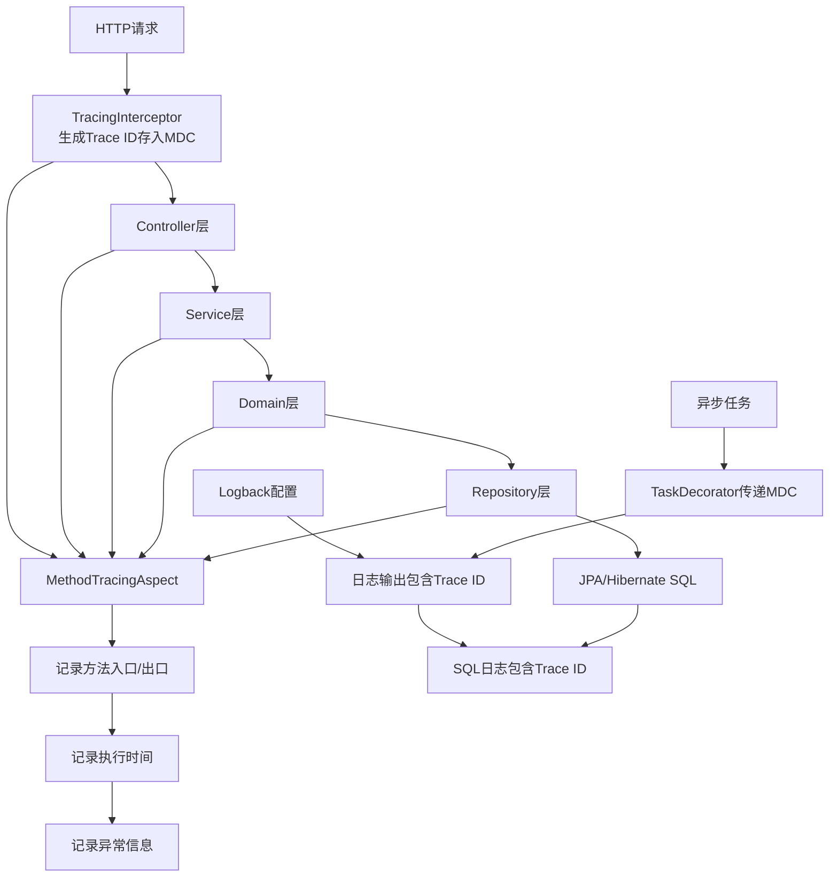

# 方法级全链路监控实施计划

## 项目概述
目标：在不集成 Zipkin/Jaeger/SkyWalking 等外部 APM 工具的前提下，实现请求级别的方法调用链路追踪。通过 Trace ID 将跨模块、跨方法的日志关联起来，便于问题排查。

**核心需求**：
1. 请求发起到执行结束中间所有执行的方法追踪
2. 数据库交互 SQL 语句监控
3. 每个方法执行时间记录
4. 异常定位与记录
5. 日志与 Trace ID 关联

## 技术架构



## 各模块实施清单

### 1. infrastructure 模块
**新增文件**：
- `infrastructure/src/main/java/com/wsf/infrastructure/tracing/`
  - `TraceIdGenerator.java` - Trace ID 生成器（使用 Snowflake）
  - `TraceContext.java` - MDC 上下文管理工具类
  - `interceptor/TracingInterceptor.java` - HTTP 请求拦截器
  - `aspect/MethodTracingAspect.java` - 方法监控 AOP 切面
  - `async/MdcTaskDecorator.java` - 异步任务 MDC 传递装饰器
  - `config/TracingAutoConfiguration.java` - 自动配置类

**修改文件**：
- `infrastructure/src/main/java/com/wsf/infrastructure/web/WebMvcConfiguration.java`
  - 注册 `TracingInterceptor`
- `infrastructure/pom.xml`
  - 确保已包含 Spring AOP 依赖（已存在 `spring-boot-starter-aop`）

### 2. start 模块
**修改文件**：
- `start/src/main/resources/logback-spring.xml`
  - 修改日志模式，添加 `%X{traceId}` 字段
  - 配置 Hibernate SQL 日志输出级别和格式
- `start/src/main/resources/application-jpa.yml`
  - 调整 Hibernate 日志配置，启用统计信息
- `start/src/main/resources/application.yml`
  - 添加监控开关配置

### 3. adapter 模块
**修改文件**：
- `adapter/src/main/java/com/wsf/adapter/web/` 下的 Controller
  - 无需修改代码，通过 AOP 自动拦截

**依赖更新**：
- `adapter/pom.xml` 依赖 infrastructure 模块

### 4. app 模块
**修改文件**：
- 无需修改代码，通过 AOP 自动拦截 Service 层方法

**依赖更新**：
- `app/pom.xml` 依赖 infrastructure 模块

### 5. domain 模块
**修改文件**：
- 无需修改代码，通过 AOP 自动拦截领域服务方法

### 6. system 模块
**修改文件**：
- 无需修改代码，通过 AOP 自动拦截

### 7. api 模块
**修改文件**：
- 无需修改，仅定义接口

## 详细实施步骤

### 阶段一：基础框架搭建
1. **创建 Trace ID 工具类**
   - `TraceIdGenerator`: 利用现有 SnowflakeIdGenerator 生成 Trace ID
   - `TraceContext`: 提供 MDC 操作静态方法（set/get/clear）

2. **实现 HTTP 请求拦截器**
   - `TracingInterceptor`: 在 preHandle 中生成/获取 Trace ID 存入 MDC
   - 支持从请求头 `X-Trace-Id` 获取外部 Trace ID
   - 在 afterCompletion 中清理 MDC

3. **配置日志格式**
   - 修改 `logback-spring.xml`，在 pattern 中添加 `[%X{traceId}]`
   - 配置 Hibernate SQL 日志 logger (`org.hibernate.SQL`, `org.hibernate.type.descriptor.sql`)

### 阶段二：方法级监控实现
4. **实现 AOP 切面**
   - `MethodTracingAspect`: 使用 `@Around` 拦截标记的方法
   - 切点表达式：`@within(org.springframework.web.bind.annotation.RestController) || @within(org.springframework.stereotype.Service) || @within(org.springframework.stereotype.Component)`
   - 记录：方法签名、参数（可配置脱敏）、开始时间、结束时间、耗时、异常

5. **实现异步任务支持**
   - `MdcTaskDecorator`: 包装 Runnable/Callable，复制 MDC 上下文
   - 配置 Spring 的 `ThreadPoolTaskExecutor` 使用此装饰器

### 阶段三：SQL 监控增强
6. **配置 Hibernate 统计**
   - 在 `application-jpa.yml` 中启用 `hibernate.generate_statistics: true`
   - 配置 SQL 格式化与注释

7. **统一 SQL 日志输出**
   - 确保 SQL 日志通过同一日志框架输出，包含 Trace ID
   - 可考虑自定义 `StatementInspector` 拦截 SQL 并记录

### 阶段四：集成与测试
8. **注册组件**
   - 在 `WebMvcConfiguration` 中注册 `TracingInterceptor`
   - 创建 `TracingAutoConfiguration` 自动配置 AOP 和异步装饰器

9. **测试验证**
   - 编写测试 Controller，模拟完整调用链
   - 验证日志中 Trace ID 的一致性
   - 验证方法耗时记录准确性
   - 验证异常信息记录
   - 验证 SQL 语句记录

## 配置项说明

### application.yml 新增配置
```yaml
tracing:
  enabled: true
  trace-id:
    generator: snowflake  # snowflake 或 uuid
    header-name: X-Trace-Id
  method:
    enabled: true
    log-args: false  # 是否记录方法参数（可能敏感）
    slow-threshold-ms: 1000  # 慢方法阈值
  sql:
    enabled: true
    log-parameters: false  # 是否记录SQL参数
```

### logback-spring.xml 修改示例
```xml
<pattern>%d %green([%thread]) [%X{traceId}] %w2_color(%level) %boldCyan(%logger{50}) - %w2_color(%msg%n)</pattern>

<!-- Hibernate SQL 日志配置 -->
<logger name="org.hibernate.SQL" level="DEBUG" additivity="false">
    <appender-ref ref="DEFAULT_STDOUT"/>
</logger>
<logger name="org.hibernate.type.descriptor.sql.BasicBinder" level="TRACE" additivity="false">
    <appender-ref ref="DEFAULT_STDOUT"/>
</logger>
```

## 依赖关系
- Spring Boot 3.5.0（已满足）
- Spring AOP（已通过 spring-boot-starter 包含）
- SLF4J + Logback（已包含）
- Hibernate 6.4.8.Final（已包含）

## 风险与缓解
1. **性能影响**：AOP 拦截和日志记录可能影响性能
   - 缓解：生产环境可关闭参数记录，仅记录方法签名和耗时
   - 使用异步日志输出（Logback AsyncAppender）

2. **日志量过大**：全量方法监控可能产生大量日志
   - 缓解：提供配置开关，可关闭非关键模块监控
   - 使用 DEBUG 级别，生产环境使用 INFO

3. **敏感信息泄露**：方法参数和 SQL 参数可能包含敏感数据
   - 缓解：默认关闭参数记录，提供脱敏注解
   - 敏感字段（如密码、token）自动脱敏

4. **异步上下文丢失**：线程池任务可能丢失 MDC
   - 缓解：通过 `MdcTaskDecorator` 确保上下文传递

## 验收标准
1. ✅ 每个 HTTP 请求生成唯一 Trace ID
2. ✅ 同一请求的所有日志包含相同 Trace ID
3. ✅ 方法执行时间准确记录
4. ✅ 异常信息包含 Trace ID 和完整堆栈
5. ✅ SQL 语句在日志中可见且包含 Trace ID
6. ✅ 异步任务中 Trace ID 正确传递
7. ✅ 配置开关生效，可关闭监控

## 后续扩展
1. **监控指标收集**：集成 Micrometer，将方法耗时等指标输出到 Prometheus
2. **链路可视化**：存储 Trace 数据，提供简单的 Web 界面查看调用链
3. **慢查询分析**：自动识别并告警慢方法和慢 SQL
4. **业务追踪**：支持业务流水号（如订单号）与 Trace ID 关联

## 时间安排
建议按阶段实施，每个阶段完成后进行验证：
1. 阶段一：1-2 天
2. 阶段二：1-2 天  
3. 阶段三：1 天
4. 阶段四：1-2 天

总预计：4-7 个工作日完成全部功能。

---
**负责人**：开发团队  
**审核人**：架构师  
**最后更新**：2026-01-01