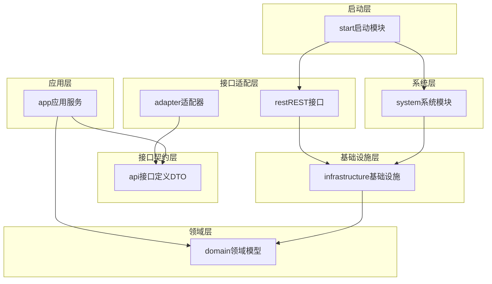
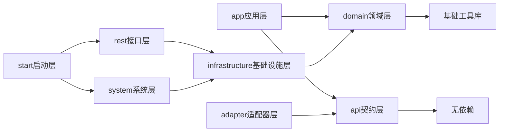
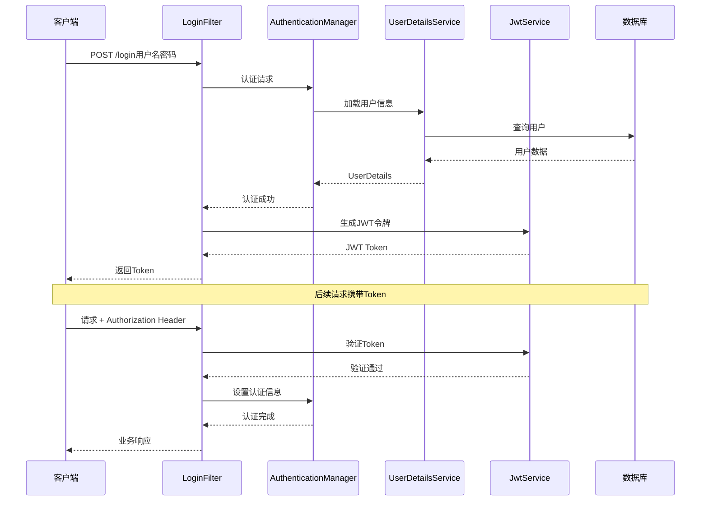
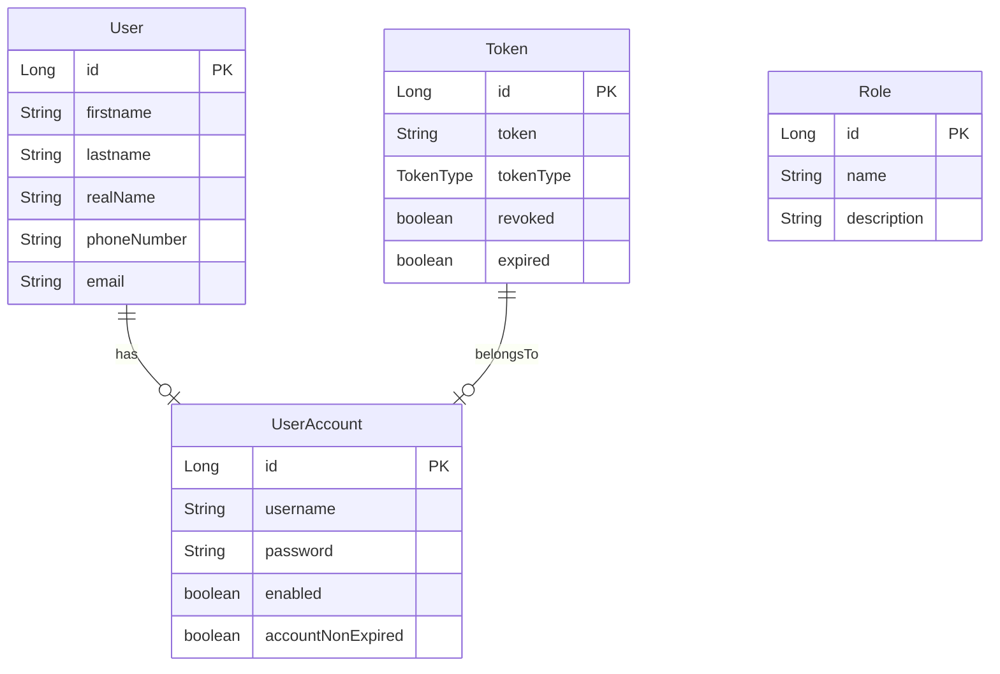
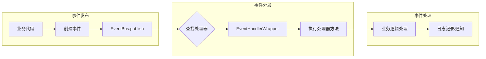
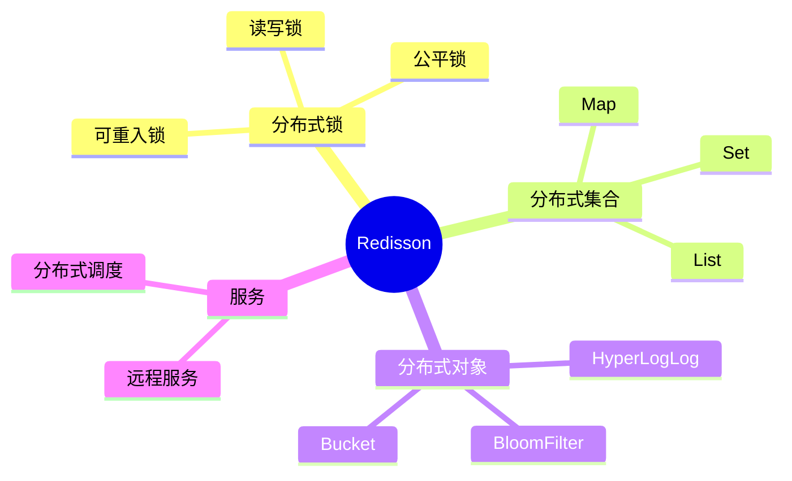
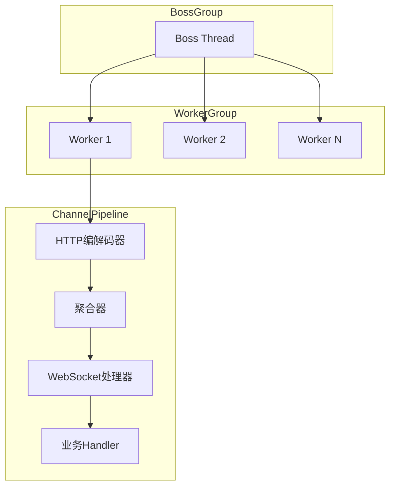
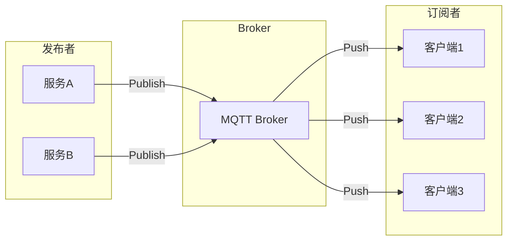
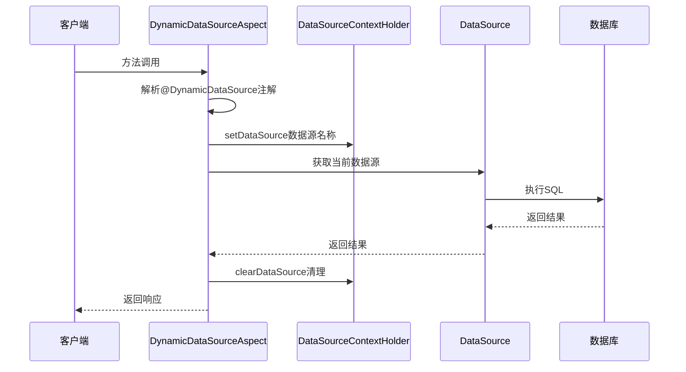

# Study Spring 项目学习计划

## 项目概述

这是一个基于 **Spring Boot 3.5.0** 和 **JDK 21** 的 Maven 多模块项目，采用 **DDD（领域驱动设计）** 架构风格，主要用于学习企业级 Java 后端开发技术。

### 技术栈总览

| 类别 | 技术 |
|------|------|
| 核心框架 | Spring Boot 3.5.0, JDK 21 |
| 持久化 | Spring Data JPA, QueryDSL 5.1.0, Hibernate |
| 数据库 | MySQL 9.2.0, PostgreSQL 42.7.5 |
| 安全认证 | Spring Security, JWT (jjwt 0.12.6) |
| 缓存 | Redisson 3.44.0 (Redis客户端) |
| API文档 | Knife4j 4.5.0 (OpenAPI 3) |
| 消息队列 | MQTT (Eclipse Paho) |
| 网络通信 | Netty (WebSocket, Modbus TCP) |
| 工具库 | Lombok, MapStruct, Guava, Hutool, Commons-Lang3 |
| 任务调度 | Quartz |
| 限流熔断 | Resilience4j |

---

## 模块架构图



---

## 模块依赖关系



---

## 学习模块详细规划

### 模块一：项目架构与DDD分层设计

#### 学习目标
- 理解Maven多模块项目的组织方式
- 掌握DDD分层架构的设计原则
- 理解各模块的职责边界和依赖关系

#### 核心文件

| 文件路径 | 说明 |
|----------|------|
| [`pom.xml`](pom.xml) | 父POM，定义所有依赖版本和子模块 |
| [`README.md`](README.md) | 项目说明和模块职责表 |
| [`domain/pom.xml`](domain/pom.xml) | 领域层依赖配置 |
| [`app/pom.xml`](app/pom.xml) | 应用层依赖配置 |
| [`api/pom.xml`](api/pom.xml) | 接口契约层配置 |

#### 关键概念

1. **领域层 (domain)**：核心业务逻辑、领域模型、领域事件
2. **应用层 (app)**：业务流程编排、用例执行
3. **接口契约层 (api)**：DTO定义、服务接口声明
4. **基础设施层 (infrastructure)**：技术实现、持久化、外部服务
5. **适配器层 (adapter)**：外部接口适配

---

### 模块二：Spring Security与JWT认证

#### 学习目标
- 掌握Spring Security 6.x配置方式
- 理解JWT令牌生成与验证机制
- 学习自定义认证过滤器和处理器

#### 核心文件

| 文件路径 | 说明 |
|----------|------|
| [`SecurityConfig.java`](infrastructure/src/main/java/com/wsf/infrastructure/security/config/SecurityConfig.java) | 安全配置核心类 |
| [`JwtService.java`](infrastructure/src/main/java/com/wsf/infrastructure/security/service/JwtService.java) | JWT令牌服务 |
| [`JwtAuthenticationTokenFilter.java`](infrastructure/src/main/java/com/wsf/infrastructure/security/filter/JwtAuthenticationTokenFilter.java) | JWT认证过滤器 |
| [`LoginFilter.java`](infrastructure/src/main/java/com/wsf/infrastructure/security/filter/LoginFilter.java) | 登录过滤器 |
| [`OpenUserDetailsService.java`](infrastructure/src/main/java/com/wsf/infrastructure/security/service/OpenUserDetailsService.java) | 用户详情服务 |

#### 认证流程图



#### 学习要点

1. **SecurityFilterChain配置**：理解过滤器链的顺序和作用
2. **密码编码器**：Argon2PasswordEncoder的使用
3. **JWT结构**：Header、Payload、Signature三部分
4. **白名单机制**：requestMatchers配置公开接口

---

### 模块三：JPA与QueryDSL数据访问

#### 学习目标
- 掌握Spring Data JPA的高级用法
- 学习QueryDSL类型安全查询
- 理解实体关系映射和审计功能

#### 核心文件

| 文件路径 | 说明 |
|----------|------|
| [`User.java`](infrastructure/src/main/java/com/wsf/infrastructure/persistence/entity/user/User.java) | 用户实体定义 |
| [`BaseEntity.java`](infrastructure/src/main/java/com/wsf/infrastructure/persistence/entity/BaseEntity.java) | 基础实体类 |
| [`EnhanceJpaRepository.java`](infrastructure/src/main/java/com/wsf/infrastructure/jpa/repository/EnhanceJpaRepository.java) | 增强JPA仓库接口 |
| [`EnhanceJpaRepositoryImpl.java`](infrastructure/src/main/java/com/wsf/infrastructure/jpa/repository/EnhanceJpaRepositoryImpl.java) | 增强仓库实现 |
| [`OpenPrimaryJpaConfig.java`](infrastructure/src/main/java/com/wsf/infrastructure/jpa/config/OpenPrimaryJpaConfig.java) | JPA配置类 |

#### 实体关系图



#### 学习要点

1. **实体注解**：@Entity, @Table, @Column, @Comment
2. **关系映射**：@OneToOne, @OneToMany, @ManyToOne
3. **审计功能**：@EntityListeners, AuditingEntityListener
4. **QueryDSL**：JPAQueryFactory类型安全查询

---

### 模块四：事件总线与领域事件

#### 学习目标
- 理解领域事件的设计理念
- 学习自定义事件总线实现
- 掌握基于注解的事件订阅机制

#### 核心文件

| 文件路径 | 说明 |
|----------|------|
| [`Event.java`](domain/src/main/java/com/wsf/domain/events/Event.java) | 事件接口定义 |
| [`BaseEvent.java`](domain/src/main/java/com/wsf/domain/events/BaseEvent.java) | 基础事件类 |
| [`UserCreatedEvent.java`](domain/src/main/java/com/wsf/domain/events/UserCreatedEvent.java) | 用户创建事件 |
| [`EventBus.java`](infrastructure/src/main/java/com/wsf/infrastructure/eventbus/EventBus.java) | 事件总线核心实现 |
| [`EventSubscribe.java`](infrastructure/src/main/java/com/wsf/infrastructure/eventbus/annotation/EventSubscribe.java) | 事件订阅注解 |
| [`EventHandlerScanner.java`](infrastructure/src/main/java/com/wsf/infrastructure/eventbus/EventHandlerScanner.java) | 处理器扫描器 |

#### 事件处理流程



#### 学习要点

1. **事件接口设计**：Event接口定义事件契约
2. **注解驱动**：@EventSubscribe注解标记处理方法
3. **SpEL表达式**：支持条件过滤
4. **同步分发**：当前实现为同步事件处理

---

### 模块五：Redis与Redisson分布式缓存

#### 学习目标
- 掌握Redisson客户端配置
- 学习分布式锁的使用
- 理解缓存策略和应用场景

#### 核心文件

| 文件路径 | 说明 |
|----------|------|
| [`RedissonConfiguration.java`](infrastructure/src/main/java/com/wsf/infrastructure/config/RedissonConfiguration.java) | Redisson配置类 |
| [`RedisUtil.java`](infrastructure/src/main/java/com/wsf/infrastructure/utils/RedisUtil.java) | Redis工具类 |
| [`RedisTokenRepositoryImpl.java`](infrastructure/src/main/java/com/wsf/infrastructure/security/extension/remermberme/RedisTokenRepositoryImpl.java) | Redis Token存储 |

#### Redisson功能特性



#### 学习要点

1. **单机/集群配置**：RedissonClient的创建方式
2. **分布式锁**：RLock的tryLock使用
3. **Token存储**：Remember Me功能的Redis实现
4. **限流器**：基于Redis的RateLimiter

---

### 模块六：Netty WebSocket实时通信

#### 学习目标
- 理解Netty线程模型
- 掌握WebSocket协议实现
- 学习ChannelPipeline配置

#### 核心文件

| 文件路径 | 说明 |
|----------|------|
| [`NettyWebSocketServer.java`](infrastructure/src/main/java/com/wsf/infrastructure/websocket/NettyWebSocketServer.java) | WebSocket服务器 |
| [`NettyChannelInitializer.java`](infrastructure/src/main/java/com/wsf/infrastructure/websocket/NettyChannelInitializer.java) | Channel初始化器 |
| [`NettyWebSocketServerHandler.java`](infrastructure/src/main/java/com/wsf/infrastructure/websocket/NettyWebSocketServerHandler.java) | 消息处理器 |

#### Netty架构图



#### 学习要点

1. **EventLoopGroup**：Boss和Worker线程组
2. **ServerBootstrap**：服务器启动配置
3. **ChannelHandler**：业务处理逻辑
4. **生命周期**：@PostConstruct和@PreDestroy

---

### 模块七：MQTT消息队列集成

#### 学习目标
- 理解MQTT协议特点
- 掌握Spring Integration MQTT配置
- 学习发布/订阅模式

#### 核心文件

| 文件路径 | 说明 |
|----------|------|
| [`MqttClientService.java`](infrastructure/src/main/java/com/wsf/infrastructure/mqtt/MqttClientService.java) | MQTT服务接口 |
| [`MqttClientInitConfig.java`](infrastructure/src/main/java/com/wsf/infrastructure/mqtt/MqttClientInitConfig.java) | MQTT初始化配置 |
| [`MqttClientCallback.java`](infrastructure/src/main/java/com/wsf/infrastructure/mqtt/MqttClientCallback.java) | 消息回调处理 |

#### MQTT通信模型



#### 学习要点

1. **QoS级别**：0、1、2三种服务质量
2. **Topic订阅**：通配符和精确匹配
3. **连接管理**：心跳、重连机制
4. **消息回调**：MqttCallback接口实现

---

### 模块八：动态数据源与多租户

#### 学习目标
- 理解动态数据源切换原理
- 学习AOP实现数据源路由
- 掌握SpEL表达式在注解中的应用

#### 核心文件

| 文件路径 | 说明 |
|----------|------|
| [`DynamicDataSource.java`](infrastructure/src/main/java/com/wsf/infrastructure/datasource/annotation/DynamicDataSource.java) | 动态数据源注解 |
| [`DynamicDataSourceAspect.java`](infrastructure/src/main/java/com/wsf/infrastructure/datasource/aspect/DynamicDataSourceAspect.java) | 切面实现 |
| [`OpenPrimaryDataSource.java`](infrastructure/src/main/java/com/wsf/infrastructure/datasource/OpenPrimaryDataSource.java) | 数据源配置 |

#### 数据源切换流程



#### 学习要点

1. **ThreadLocal存储**：线程级别的数据源标识
2. **AOP切面**：@Before/@After环绕处理
3. **SpEL解析**：动态计算数据源名称
4. **事务协调**：确保在事务之前执行

---

### 模块九：其他基础设施组件

#### 学习目标
- 了解项目中的辅助组件
- 学习文件监控、Modbus等扩展功能

#### 核心组件

| 组件 | 文件路径 | 说明 |
|------|----------|------|
| 文件监控 | [`WatchFileService.java`](infrastructure/src/main/java/com/wsf/infrastructure/watchfile/commonsio/WatchFileService.java) | 基于Commons IO的文件监控 |
| Modbus客户端 | [`ModbusClient.java`](infrastructure/src/main/java/com/wsf/infrastructure/modbus/client/ModbusClient.java) | Modbus TCP客户端实现 |
| Modbus服务端 | [`ModbusTcpServer.java`](infrastructure/src/main/java/com/wsf/infrastructure/modbus/server/ModbusTcpServer.java) | Modbus TCP服务端 |
| 限流过滤器 | [`UserAwareRateLimitFilter.java`](infrastructure/src/main/java/com/wsf/infrastructure/security/filter/UserAwareRateLimitFilter.java) | 用户级限流 |
| VFS支持 | [`ApacheVfsApplicationContextInitializer.java`](infrastructure/src/main/java/com/wsf/infrastructure/vfs/ApacheVfsApplicationContextInitializer.java) | 虚拟文件系统支持 |
| Quartz配置 | [`QuartzConfiguration.java`](infrastructure/src/main/java/com/wsf/infrastructure/quartz/config/QuartzConfiguration.java) | 定时任务配置 |

---

## 学习建议

### 推荐学习顺序

1. **入门阶段**：模块一 → 模块三 → 模块二
2. **进阶阶段**：模块四 → 模块五 → 模块六
3. **扩展阶段**：模块七 → 模块八 → 模块九

### 实践建议

1. **搭建环境**：确保JDK 21和Maven正确配置
2. **运行项目**：使用`start.bat`或`start.sh`启动
3. **调试跟踪**：通过断点理解代码执行流程
4. **修改实验**：尝试添加新功能或修改现有功能
5. **单元测试**：为关键组件编写测试用例

### 配置文件说明

| 文件 | 说明 |
|------|------|
| [`application.yml`](start/src/main/resources/application.yml) | 主配置文件 |
| [`application-datasource.yml`](start/src/main/resources/application-datasource.yml) | 数据源配置 |
| [`application-jpa.yml`](start/src/main/resources/application-jpa.yml) | JPA配置 |
| [`application-redis.yml`](start/src/main/resources/application-redis.yml) | Redis配置 |
| [`logback-spring.xml`](start/src/main/resources/logback-spring.xml) | 日志配置 |

---

## 项目启动

### 前置条件

- JDK 21+
- Maven 3.8+
- MySQL 8.0+ 或 PostgreSQL
- Redis 6.0+

### 启动步骤

```bash
# 1. 编译项目
mvn clean install -DskipTests

# 2. 启动应用
# Windows
start.bat

# Linux/Mac
./start.sh

# 或直接运行主类
mvn spring-boot:run -pl start
```

### 访问地址

- 应用端口：`http://localhost:40001`
- API文档：`http://localhost:40001/doc.html`
- WebSocket：`ws://localhost:8090`

---

## 总结

本项目是一个综合性的Spring Boot学习项目，涵盖了企业级应用开发的主要技术栈。通过系统学习各模块，可以全面掌握：

1. **架构设计**：DDD分层、模块化设计
2. **安全认证**：Spring Security + JWT
3. **数据访问**：JPA + QueryDSL
4. **事件驱动**：自定义事件总线
5. **分布式系统**：Redis、分布式锁
6. **实时通信**：WebSocket、MQTT
7. **工业协议**：Modbus TCP
8. **高级特性**：动态数据源、限流熔断

建议按照模块顺序逐步深入学习，每个模块都要结合代码实践，这样才能真正掌握相关技术。
